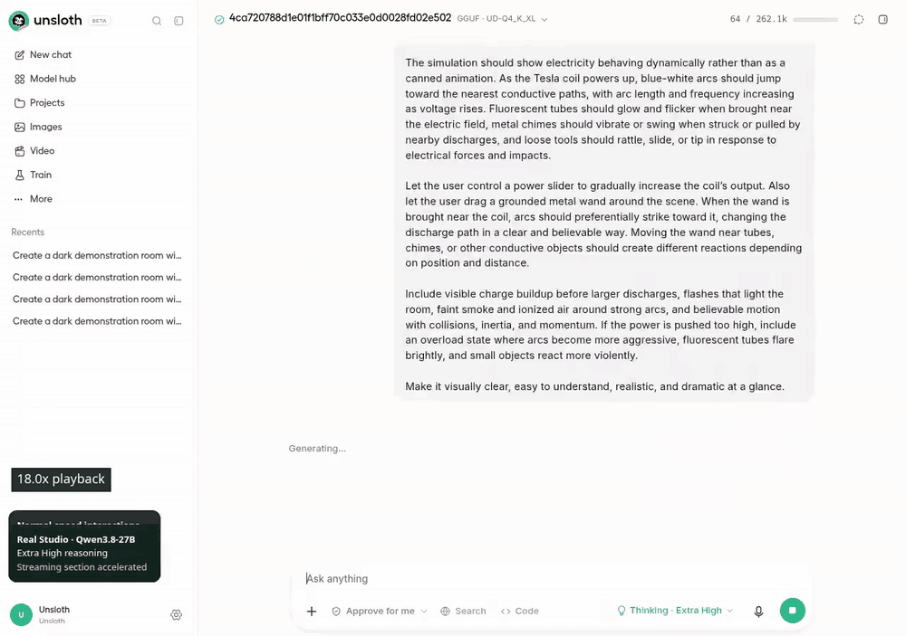

# Reasoning transcript PR evidence

Code branch: [fix/reasoning-inline-transcript](https://github.com/wasimysaid/unsloth/tree/fix/reasoning-inline-transcript), tested final commit 044e4e77b.

This orphan branch contains only review evidence. Media is not part of the upstream code diff. No auth state, credentials, server logs, full reasoning text, or local filesystem paths are included.

## Real Studio recording

[MP4 video](reasoning-live-studio.mp4) · [Sanitized benchmark intervals and assertions](benchmarks.json)

Qwen3.8-27B-UD-Q4_K_XL, Extra High reasoning, exact Tesla-coil prompt from the task. The final recording generated 60,125 reasoning characters. Approximately three minutes of streaming are compressed to ten seconds at 18×; eight seconds of interactions run at normal speed. Live reading and reopening both measured **0 px drift**. Collapsing unmounted the transcript; reopening mounted the beginning; following resumed through the existing button.

The GIF is 6 FPS for attachment size; the MP4 is 30 FPS. Those playback rates are not the app benchmark. Capture-inclusive measurements are explicitly separate in benchmarks.json.

## Unrecorded benchmark summary

| Scenario | Average FPS | p95 frame time |
| --- | ---: | ---: |
| High reasoning | 60.0 | 16.7–16.8 ms |
| Extra High reasoning | 60.0 | 16.7–16.8 ms |
| High answer, isolated intervals | 59.2–59.8 | 16.8 ms |
| Extra High answer, clean follow interval | 59.9 | 16.7 ms |

High produced 65,828 reasoning characters; Extra High produced 118,756. The listed reasoning intervals had no >50 ms frames or long tasks. Answer rendering still had occasional spikes: worst 400.1 ms (High) and 366.6 ms (Extra High). These are headless Chromium rAF intervals at approximately 60 Hz, not guaranteed performance on every device.

## Verification

- 8,342 frontend tests pass; typecheck, production build, strict translation parity, and whitespace checks pass.
- Production browser assertions cover bounded content, removed pagination chrome, canonical full-source copy, saved/live reopening, long-prompt reopening, threshold/streaming/resize anchors, selection retention, resume following, narrow code, and light/dark.
- Final real reopening regression: 0 px drift. Earlier desktop-to-mobile reflow retained the passage with 47.6 px drift and no horizontal overflow. Threshold activation drift stayed below 0.35 px.
- Focused lint has no errors. Full-repository lint retains pre-existing failures. Native WebKit FPS validation is incomplete.
- Generated Tesla HTML had separate runtime errors, so no simulation FPS claim is made. Chat-history 404s were observed separately. Full-trace search is not added.
- Isolated Studio and its model were stopped after recording; the GPU allocation was released.

Reproduce the frontend checks with npm run typecheck, npm test, npm run build, and npm run i18n:check:strict in studio/frontend. Build the production test harness with vite build --config vite.reasoning.config.ts, open smoke-reasoning-transcript.html through the corresponding Vite preview, and run tests/studio/reasoning-transcript-checks.js with Playwright CLI.
