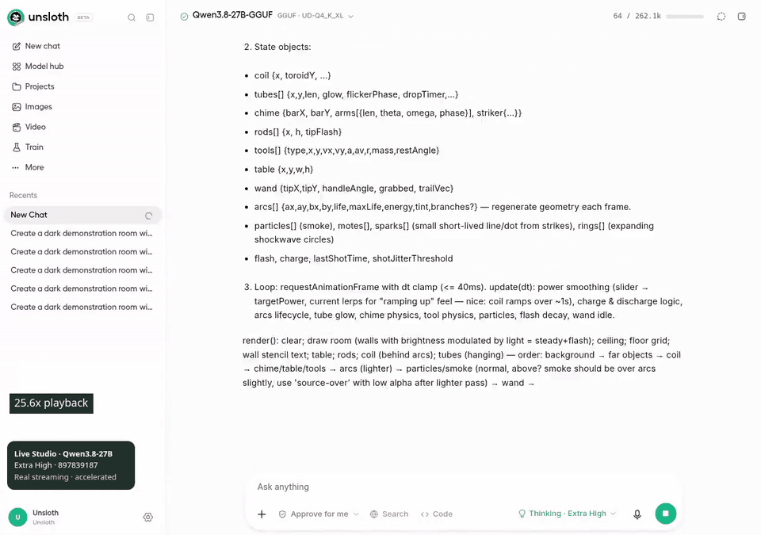

# Refreshed live Studio demo — 897839187

[MP4](reasoning-live-studio-897839187.mp4) · [Sanitized measurements](reasoning-live-studio-897839187.json)

Actual EC2 Studio at 897839187220ed52cb5471d92df41f6dc155478b, using Qwen3.8-27B-UD-Q4_K_XL with Extra High reasoning and the original Tesla-coil prompt. No synthetic token replay. The generation produced 93,005 reasoning characters before being manually stopped after the live interactions.

The edit compresses 204.4 seconds of actual streaming into eight seconds (25.6×), then shows eight seconds of normal-speed reading/collapse/reopen/resume-following and four seconds of normal-speed code copy/download. The jump to the later code-controls segment is an edit, not uninterrupted interaction. Copy and download matched for 1,001 characters of generated code. Reopen header drift: 0px. The automatic reading-position sample was unavailable in this capture, so no numeric reading-drift claim is made.

The unrecorded performance interval is separate from the recording interval in the JSON. GIF playback is 6 FPS for attachment size; MP4 playback is 30 FPS. Neither is a benchmark of app FPS. This is a frontend UX recording, not a claim about the generated Tesla simulation's performance.

The isolated Studio/model was stopped after capture, releasing its GPU allocation. Other users' jobs and the existing SSH tunnel were left running. Existing chat-history 404s were observed. Three new Codex follow-up findings on this commit remain pending; the recording is not blanket review approval. No credentials, browser storage, server logs, full reasoning source, or private filesystem paths are published.
